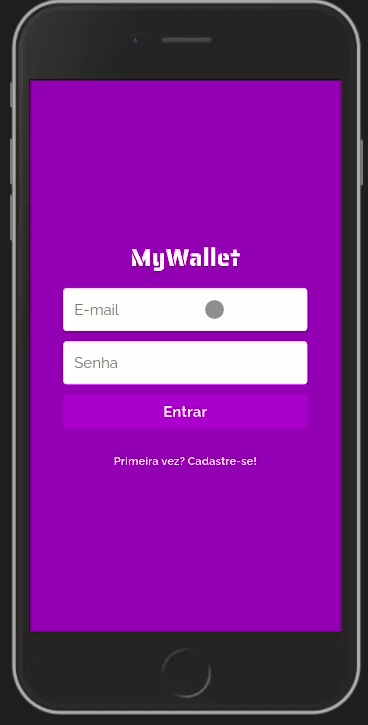

# My Wallet

An easy to use financial manager app. Track your revenues and expenses to learn how you spend your money and know all the time how much you have.



Try it out now at https://my-wallet-front-three.vercel.app/

## About

This is an web application with which lots of people can manage their own expenses and revenues. Below are the implemented features:

- Sign-up, log-in, and logout
- Insert new revenue or expense
- List all financial events for a user
- Calculate balance
- Delete and update financial event

By using this app any user can learn how they've been using their money and always keep track of your balance.

## Technologies

The following tools and frameworks were used in the construction of the project:

<a title="React" href="https://pt-br.reactjs.org/" target="_blank" rel="noreferrer"> 
     
</a>
<a title="HTML" href="https://www.w3.org/html/" target="_blank" rel="noreferrer"> 
     
</a>
<a title="CSS" href="https://www.w3schools.com/css/" target="_blank" rel="noreferrer"> 
     
</a>
<a title="JavaScript" href="https://developer.mozilla.org/en-US/docs/Web/JavaScript" target="_blank" rel="noreferrer"> 
     
</a>

## Requirements

### [npm](https://www.npmjs.com/)

<details>
    <summary>install npm</summary>

```bash
wget -qO- <https://raw.githubusercontent.com/nvm-sh/nvm/v0.38.0/install.sh> | bash

## Or this command
wget -qO- https://raw.githubusercontent.com/nvm-sh/nvm/v0.38.0/install.sh | bash

# Close and open terminal
nvm install --lts
nvm use --lts
# Verify node version
node --version # Must show v14.16.1
# Verify npm version
npm -v
```

</details>

## How to run

1. Clone this repository
2. Clone the [back-end repository](https://github.com/leonardo-otero390/MyWallet-Back) and follow instructions
3. Install dependencies

```bash
npm i
```

4. Run the front-end with production database

```bash
npm start
```

5. If you want to run with backend development mode

```bash
npm run dev
```

6. You can optionally build the project running

```bash
npm run build
```
